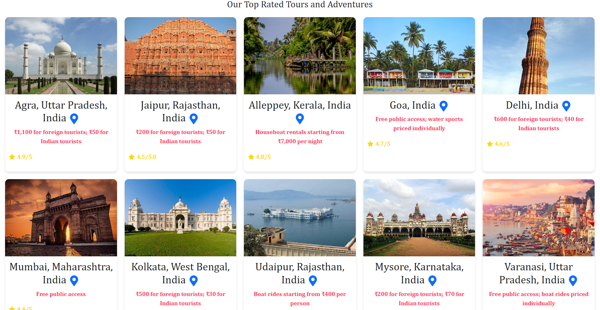
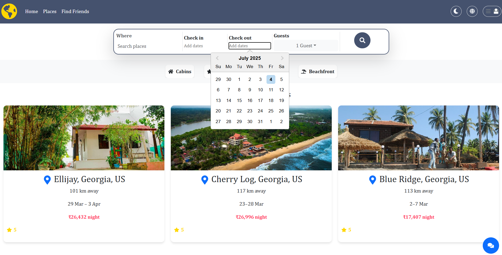

# 🌍 Trip Planner








## Overview <hr>

The AI based Trip Planner is a webplatform designed for the travelers, It's similar to airbnb and other platform but Here we aim to add extra features that ease the traveling for the users by providing chatbot where they can chat and gain handson knowledge on the most visited places, and can ask for the recommendations as well. Moreover, we aim to add make friend page where travelers can chat with each other inorder to decide common destinations which will help them to share their journey.

## ✨ Features Table

| Feature                   | Description                                                                     |
| ------------------------- | ------------------------------------------------------------------------------- |
| 🧠 AI Chatbot             | Users can interact with a chatbot to get recommendations and travel tips.       |
| 🗺️ Destination Guide      | Provides information about the most visited places, attractions, and landmarks. |
| 🤝 Make Friends Page      | Allows travelers to connect, chat, and plan trips together.                     |
| 🏨 Stay Booking Support   | Similar to Airbnb, users can find and book accommodations.                      |
| 📍 Personalized Itinerary | AI suggests personalized travel plans based on user interests.                  |
| 🛠️ Admin Dashboard        | Admins and hosts can manage their listings, users, and activity.                |
| 🌐 Interactive Map        | Visualizes travel locations and user journeys using maps.                       |
| 🔐 User Authentication    | Secure login and registration for travelers and hosts.                          |

## 🧰 Tech Stack

| Layer                 | Technology                          |
| --------------------- | ----------------------------------- |
| 💻 Frontend           | React.js, Typescript,html,css Vite  |
| 🖥️ Backend (Planned)  | Node.js                             |
| 🗄️ Database           | Firebase (Firestore or Realtime DB) |
| 🔐 Authentication     | Firebase Authentication             |
| 🧠 AI Integration     | Dialogflow (Chatbot - Planned)      |
| 🗺️ Maps Integration   | Google Maps API (Planned)           |
| 🎨 Styling (Optional) | CSS, Tailwind CSS (if applied)      |
| ☁️ Hosting (Assumed)  | Firebase Hosting                    |

## ⚙️ Installation & Setup Guide

Follow the steps below to set up the project locally:

### 1. Clone the Repository

```bash
git clone https://github.com/Richajaishwal0/Trip_assistant.git
cd Trip_assistant
```

### 2. Install dependencies

```bash
npm install
```

### 3. Start Development Server

```bash
npm run dev
```

Visit the app at: http://localhost:5173

## 📌 Note for Contributors

We welcome and appreciate all contributions — big or small!

🔧 Currently, only a part of the **frontend** has been implemented. The **backend** and many key features are still **under development or planned**.

Feel free to contribute in the following ways:

- 🐞 Find and report bugs or UI issues
- ✨ Suggest and implement new features
- 🧹 Improve code structure or performance
- 💡 Enhance UI/UX design
- 📄 Update documentation

Whether it’s a small typo fix or a new functionality, your contribution makes a difference! Please fork the repo, make your changes, and open a pull request.

Let's build something great together! 🚀

### 🚀 Future Enhancements

| Feature                          | Description                                                 |
| -------------------------------- | ----------------------------------------------------------- |
| 🧠 Smart AI Chatbot              | Enhanced chatbot using NLP for smarter query handling.      |
| 📱 Mobile Responsiveness         | Optimize for all screen sizes and devices.                  |
| 🤝 Social Integration            | Google/Facebook login and trip sharing options.             |
| 💬 Real-time Chat System         | Live chat among travelers using Firebase or WebSockets.     |
| 📍 Geolocation-based Suggestions | Suggest destinations based on user’s real-time location.    |
| 🏅 Reward System                 | Introduce user badges and rewards for active participation. |
| 📦 PWA Support                   | Add Progressive Web App support for offline access.         |
| 🧳 Travel Budget Planner         | Tool for estimating and managing travel expenses.           |
