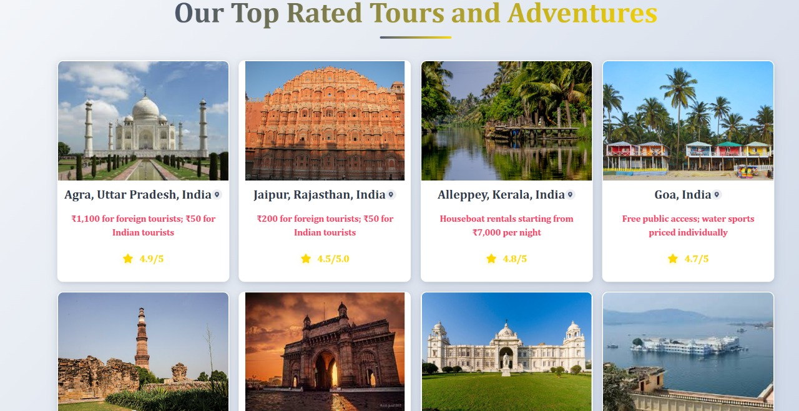
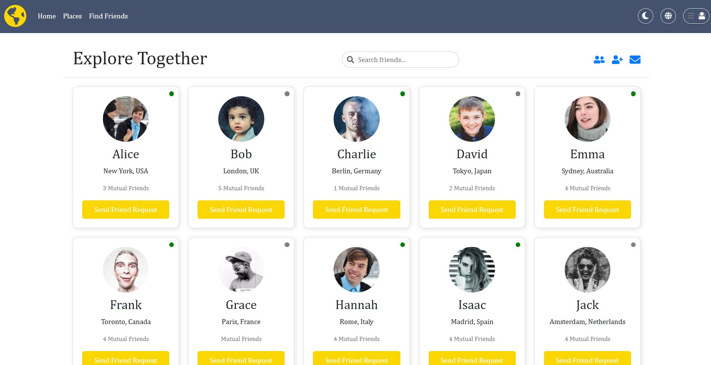
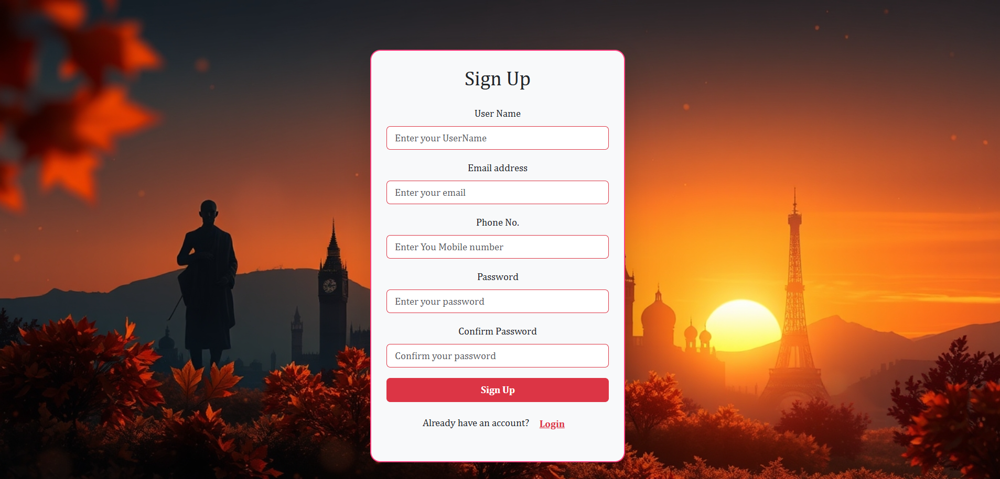

# 🌍 Trip Planner


## Overview

**Trip Planner** is a modern, AI-powered travel planning web application built with the MERN stack (MongoDB, Express, React, Node.js). It helps travelers effortlessly create personalized itineraries, discover top destinations, book accommodations, and connect with fellow travelers. The platform features an interactive chatbot for recommendations, a friend-finding system, and an admin dashboard for property management—making it your one-stop solution for seamless travel experiences.

---

## ✨ Features

| Feature                   | Description                                                                     |
| ------------------------- | ------------------------------------------------------------------------------- |
| 🧠 AI Chatbot             | Get travel recommendations and tips via an interactive chatbot.                 |
| 🗺️ Destination Guide      | Explore information about top places, attractions, and landmarks.               |
| 🤝 Find Friends           | Connect and chat with other travelers to plan trips together.                   |
| 🏨 Stay Booking Support   | Find and book accommodations (Airbnb-style listings).                           |
| 📍 Personalized Itinerary | AI suggests travel plans based on your interests.                               |
| 🛠️ Admin Dashboard        | Admins/hosts can manage property listings and view bookings.                    |
| 🔐 User Authentication    | Secure login and registration for travelers and hosts (Firebase Auth).          |
| 🌐 Multi-language         | Supports English, Hindi, and French.                                            |
| 🌙 Dark Mode              | Toggle between light and dark themes.                                           |
| 📱 Responsive Design      | Fully responsive for mobile and desktop.                                        |
| ☁️ Cloud Database         | Uses MongoDB and Firebase for scalable data storage.                            |

---

## 🧰 Tech Stack

| Layer                 | Technology                                   |
| --------------------- | -------------------------------------------- |
| 💻 Frontend           | React.js, TypeScript, Vite, Bootstrap        |
| 🖥️ Backend            | Node.js, Express                             |
| 🗄️ Database           | MongoDB (Mongoose), Firebase (optional)      |
| 🔐 Authentication     | Firebase Authentication                      |
| 🧠 AI Integration     | Custom Chatbot (API endpoint)                |
| 🌍 i18n               | react-i18next                                |
| 🎨 Styling            | CSS, Bootstrap, custom styles                |

> **Note:** The backend uses MongoDB (via Mongoose) for data storage. Firebase is used for authentication and can be used for additional data storage if needed.

---

## 🚀 Getting Started

### Prerequisites
- Node.js (v18+ recommended)
- npm (v9+ recommended)
- MongoDB (local or [MongoDB Atlas](https://www.mongodb.com/atlas))
- Firebase account (for authentication and/or database)

### 1. Clone the Repository
```bash
git clone <your-repo-url>
cd react_app
```

### 2. Install Dependencies
#### For the frontend (React):
```bash
cd client
npm install
```
#### For the backend (Express):
```bash
cd ../server
npm install
```

### 3. Start the Frontend (React)
```bash
cd ../client
npm run dev
```
Visit the app at: [http://localhost:5173](http://localhost:5173)

### 4. Start the Backend (Express API)
Open a new terminal and run:
```bash
cd server
npm start # or node server.js
```
The backend will run at [http://localhost:5000](http://localhost:5000)

> **Note:**
> - Ensure your MongoDB server is running and update the backend connection string as needed (see `server/server.js`).
> - For Firebase, set up your project and add your configuration to the relevant files.

---

## 🖼️ Screenshots

| Home Page | Places | Find Friends | Admin Dashboard |
|-----------|--------|--------------|-----------------|
|  |  |  |  |

---

## 🛠️ Project Structure

```
react_app/
  client/
    index.html
    package-lock.json
    package.json
    public/
      vite.svg
    site_images_/
      image-1.png
      image-2.png
      image-3.png
      image-4.png
      image-5.png
      image.png
    src/
      App.css
      App.tsx
      assets/
        react.svg
        TripLogo.svg
      components/
        chatbot.css
        chatbot.tsx
        childnavbar.tsx
        footer.tsx
        Navigation.tsx
        placeCard.css
        placeCard.tsx
        searchbar.tsx
      i18n.js
      images/
        bg-auth.jpg
        home1.jpg
        home2.jpg
        home3.jpg
        home4.jpg
        home5.jpeg
        ihome_image.png
        logo1.jpg
      main.tsx
      Message.tsx
      pages/
        Admin/
          Add.tsx
          admin.css
          admin.tsx
        Auth.tsx
        FindFriends.tsx
        home.css
        home.tsx
        Places.css
        Places.tsx
      responsive.css
      utils/
        errorHandlerToast.ts
        toastUtils.ts
      vite-env.d.ts
  Contributing.md
  eslint.config.js
  README.md
  server/
    server.js
  src/
  tsconfig.app.json
  tsconfig.json
  tsconfig.node.json
  vite.config.ts
```

---

## 🧑‍💻 Contributing

We welcome all contributions—big or small! See [Contributing.md](Contributing.md) for guidelines.

- Report bugs or UI issues
- Suggest and implement new features
- Improve code structure or performance
- Enhance UI/UX design
- Update documentation

---

## 📌 Future Enhancements

| Feature                          | Description                                                 |
| -------------------------------- | ----------------------------------------------------------- |
| 🧠 Smarter AI Chatbot            | Enhanced NLP for smarter query handling.                    |
| 📱 Mobile App                    | Native mobile app support.                                  |
| 🤝 Social Integration            | Google/Facebook login and trip sharing.                     |
| 💬 Real-time Chat                | Live chat among travelers.                                  |
| 📍 Geolocation Suggestions       | Destinations based on user’s real-time location.            |
| 🏅 Reward System                 | Badges and rewards for active users.                        |
| 📦 PWA Support                   | Progressive Web App/offline access.                         |
| 🧳 Travel Budget Planner         | Tool for managing travel expenses.                          |
| ☁️ Multi-DB Support              | Seamless integration with MongoDB, Firebase, and more.      |

---

## 📄 License

This project is licensed under the ISC License.

---

## 🙏 Acknowledgements
- [React](https://react.dev/)
- [Vite](https://vitejs.dev/)
- [Bootstrap](https://getbootstrap.com/)
- [react-i18next](https://react.i18next.com/)
- [MongoDB](https://www.mongodb.com/)
- [Firebase](https://firebase.google.com/)
- [Express](https://expressjs.com/)

---

> Made with ❤️ for travelers everywhere!
