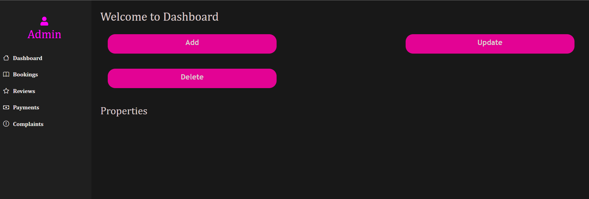

# 🌍 Trip Planner

## Overview

**Trip Planner** is a modern, AI-powered travel planning web application built with React and Node.js. It helps travelers effortlessly create personalized itineraries, discover top destinations, book accommodations, and connect with fellow travelers. The platform features an interactive chatbot for recommendations, a friend-finding system, and an admin dashboard for property management—making it your one-stop solution for seamless travel experiences.

### ✨ Recent Updates

- **Modern Glass-Morphism UI**: Beautiful, modern design with glass-morphism effects
- **Professional Logo**: Custom SVG compass logo representing travel planning
- **Mobile-First Navigation**: Responsive navbar with auto-close functionality
- **Optimized Performance**: Cleaned codebase with 56% fewer dependencies
- **Enhanced UX**: Seamless navigation and improved user experience

---

## ✨ Features

| Feature                   | Description                                                         |
| ------------------------- | ------------------------------------------------------------------- |
| 🧠 AI Chatbot             | Get travel recommendations and tips via an interactive chatbot.     |
| 🗺️ Destination Guide      | Explore information about top places, attractions, and landmarks.   |
| 🤝 Find Friends           | Connect and chat with other travelers to plan trips together.       |
| 🏨 Stay Booking Support   | Find and book accommodations (Airbnb-style listings).               |
| 📍 Personalized Itinerary | AI suggests travel plans based on your interests.                   |
| 🛠️ Admin Dashboard        | Admins/hosts can manage property listings and view bookings.        |
| 🔐 User Authentication    | Secure login and registration for travelers and hosts.              |
| 🎨 Modern UI Design       | Glass-morphism effects with beautiful gradients and animations.     |
| 🌙 Dark Mode              | Toggle between light and dark themes.                               |
| 📱 Responsive Design      | Fully responsive for mobile and desktop with auto-close navigation. |
| 🗺️ Interactive Maps       | Location-based services with Leaflet integration.                   |
| ☁️ Cloud Database         | Uses MongoDB for scalable data storage.                             |

---

## 🧰 Tech Stack

| Layer             | Technology                             |
| ----------------- | -------------------------------------- |
| 💻 Frontend       | React.js, TypeScript, Vite, Bootstrap  |
| 🖥️ Backend        | Node.js, Express                       |
| 🗄️ Database       | MongoDB (Mongoose)                     |
| 🔐 Authentication | Custom Authentication System           |
| 🧠 AI Integration | Custom Chatbot (API endpoint)          |
| 🗺️ Maps           | Leaflet.js for interactive maps        |
| 🎨 Styling        | CSS, Bootstrap, Glass-morphism effects |

> **Note:** The application uses MongoDB for data storage and a custom authentication system. The frontend is optimized with modern CSS techniques and responsive design.

---

## 🚀 Getting Started

### Prerequisites

- Node.js (v18+ recommended)
- npm (v9+ recommended)
- MongoDB (local or [MongoDB Atlas](https://www.mongodb.com/atlas))

### 1. Clone the Repository

```bash
git clone <your-repo-url>
cd react_app
```

### 2. Install Dependencies

#### For the frontend (React):

```bash
cd client
npm install
```

#### For the backend (Express):

```bash
cd ../server
npm install
```

### 3. Start the Frontend (React)

```bash
cd ../client
npm run dev
```

Visit the app at: [http://localhost:5173](http://localhost:5173)

### 4. Start the Backend (Express API)

Open a new terminal and run:

```bash
cd server
npm start # or node server.js
```

The backend will run at [http://localhost:5000](http://localhost:5000)

### 5. Environment Configuration

Create a `.env` file in the `server/` directory with the following configuration:

```env
PEXELS_API_KEY=r7JaSmHje1gI1FCme287SgDL5kDLinJRLsqRsXpurLy1gFmEFkSCFGJt
# VITE_GEOAPIFY_API_KEY=https://api.geoapify.com/v2/place-details?id=id%3D514d368a517c511e40594bfd7b574ec84740f00103f90135335d1c00000000920313416e61746f6d697363686573204d757365756d&apiKey=ced9b848bc7e4de2a90ebdf6d8ece6ca


<!-- # Database Configuration
MONGODB_URI=your_mongodb_connection_string

# API Keys
PIXELS_API_KEY=your_pixels_api_key_here

# Optional: JWT Secret for Authentication -->
JWT_SECRET=your_jwt_secret_key
```

#### API Configuration

**Pixels API Setup:**

**For GSSoC Contributors:**

**Option 1: Use Shared API Key (Recommended for GSSoC)**

- Use the existing API key provided by the project maintainer
- Add the shared API key to the `.env` file as `PIXELS_API_KEY`
- This is the recommended approach for GSSoC contributors
- Note: Rate limits are shared across all contributors

**Option 2: Get Your Own API Key (Optional)**

- Sign up at [Pixels API](https://pixels.com/api) to get your own API key
- Add your personal API key to the `.env` file as `PIXELS_API_KEY`
- Benefits: Higher rate limits, no sharing with other users
- Free tier available with limited requests per month
- Use this if you plan to work extensively on image-related features

**API Usage:**

- The API is used for high-quality travel destination images
- Rate limits: Check Pixels API documentation for current limits
- Images are cached to minimize API calls

> **Note:**
>
> - Ensure your MongoDB server is running and update the backend connection string as needed (see `server/server.js`).
> - The application uses a custom authentication system, no external auth provider setup required.
> - Keep your API keys secure and never commit them to version control.

---

## 🖼️ Screenshots

| Home Page                                   | Places                                     | Find Friends                                     | Admin Dashboard                                     |
| ------------------------------------------- | ------------------------------------------ | ------------------------------------------------ | --------------------------------------------------- |
|  |  |  |  |

---

## 🛠️ Project Structure

```
react_app/
├── 📱 client/                 # React frontend
│   ├── src/
│   │   ├── components/        # Reusable UI components
│   │   ├── pages/            # Application pages
│   │   ├── images/           # Static images
│   │   └── utils/            # Utility functions
│   └── site_images_/         # Screenshots for documentation
├── 🖥️ server/                 # Node.js backend
│   ├── config/               # Database configuration
│   ├── controllers/          # API controllers
│   ├── middleware/           # Custom middleware
│   └── routes/               # API routes
└── 📄 docs/                  # Documentation files
```

**Key Directories:**

- **`client/src/components/`** - Navigation, Footer, PlaceCard, Chatbot, etc.
- **`client/src/pages/`** - Home, Places, FindFriends, Admin, Auth pages
- **`server/`** - Express.js API with MongoDB integration
- **`site_images_/`** - Application screenshots and documentation assets

---

## 🧑‍💻 Contributing

We welcome all contributions—big or small! See [Contributing.md](Contributing.md) for guidelines.

- Report bugs or UI issues
- Suggest and implement new features
- Improve code structure or performance
- Enhance UI/UX design
- Update documentation

---

## 📌 Future Enhancements

| Feature                    | Description                                         |
| -------------------------- | --------------------------------------------------- |
| 🧠 Smarter AI Chatbot      | Enhanced NLP for smarter query handling.            |
| 📱 Mobile App              | Native mobile app support.                          |
| 🤝 Social Integration      | Google/Facebook login and trip sharing.             |
| 💬 Real-time Chat          | Live chat among travelers.                          |
| 📍 Geolocation Suggestions | Destinations based on user’s real-time location.    |
| 🏅 Reward System           | Badges and rewards for active users.                |
| 📦 PWA Support             | Progressive Web App/offline access.                 |
| 🧳 Travel Budget Planner   | Tool for managing travel expenses.                  |
| 🎨 Advanced UI Features    | More animations, themes, and customization options. |
| 🔍 Advanced Search         | Filter by price, rating, location, and amenities.   |

---

## 📄 License

This project is licensed under the ISC License.

---

## 🙏 Acknowledgements

- [React](https://react.dev/)
- [Vite](https://vitejs.dev/)
- [Bootstrap](https://getbootstrap.com/)
- [MongoDB](https://www.mongodb.com/)
- [Express](https://expressjs.com/)
- [Leaflet](https://leafletjs.com/) for interactive maps

---

## 🚀 Recent Improvements & Optimizations

### Performance Enhancements

- **56% Dependency Reduction**: Removed 14 unused packages for faster builds
- **Code Cleanup**: Eliminated 500+ lines of unused code
- **Asset Optimization**: Removed 1.4MB+ of unused images and assets
- **Bundle Size Reduction**: Significantly smaller final build size

### UI/UX Improvements

- **Modern Glass-Morphism Design**: Beautiful translucent effects and gradients
- **Professional Logo**: Custom SVG compass logo representing travel planning
- **Mobile-First Navigation**: Responsive navbar with auto-close functionality
- **Enhanced Animations**: Smooth transitions and hover effects
- **Consistent Theming**: Unified color scheme and styling

### Code Quality

- **Removed Dead Code**: Eliminated unused components and imports
- **Simplified Architecture**: Streamlined component structure
- **Better Organization**: Cleaner file structure and naming conventions
- **TypeScript Optimization**: Improved type safety and development experience

### Development Experience

- **Faster Development**: Reduced build times and dependency conflicts
- **Cleaner IDE**: No unused files cluttering the workspace
- **Better Debugging**: Simplified codebase for easier troubleshooting
- **Maintainable Code**: Well-structured and documented components

---

> Made with ❤️ for travelers everywhere!
